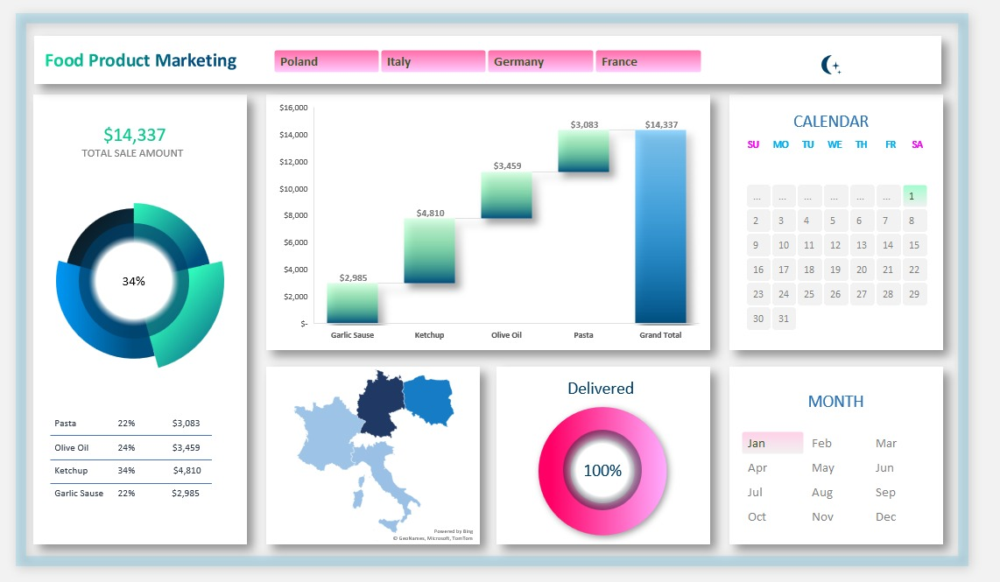

# 📊 Food Product Marketing Dashboard

### 🚀 Project Overview
This interactive Excel dashboard tracks sales performance for a food marketing firm across four major European markets (Poland, Italy, Germany, France). It was designed to replace static reports with a dynamic tool that visualizes **$488k+ in revenue** and highlights key regional trends.

*(Click the image to zoom in)*

### 🔍 Business Problem
The marketing team needed a centralized way to monitor product performance. Previously, data was scattered across multiple spreadsheets, making it difficult to answer:
*   Which region is driving the most revenue?
*   How are individual products (Pasta, Olive Oil, etc.) performing month-over-month?
*   Where are the shipping bottlenecks?

### 🛠️ Solution & Features
I built a custom "Neumorphic" UI (soft UI) dashboard in Excel that features:
*   **Dynamic Filtering:** Slicers for Country (Poland, Italy, Germany, France) instantly update all charts.
*   **Waterfall Analysis:** Visualizes cumulative sales impact to identify the highest-contributing products.
*   **Geographic Heatmap:** A Map Chart showing sales density across the EU regions.
*   **Custom Calendar UI:** A clickable calendar selector for precise date filtering.
*   **KPI Trackers:** "At-a-glance" cards for Total Sales and Delivery status.

*Created by Simratbir Singh
